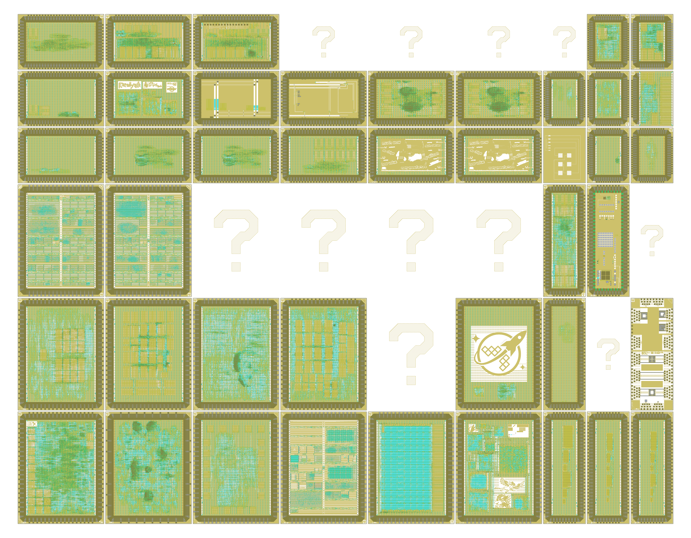

# wafer.space Run 2

[wafer.space](https://wafer.space/) GF180MCU Run 2

- Shuttle ID: G802
- Process: GF180MCU
- Number of slots: 54 (18x 1×1, 18x 1×0.5, 9x 0.5×1, 9x 0.5×0.5)

<table width="100%">
  <tr>
  <td width="50%"></td>
  <td width="50%"></td>
  </tr>
</table>

The "?" indicate private projects that have been obfuscated to hide their layout.

# Public Projects

| Code | Project | Slot Size | Project Details | Repository |
|---|---|---|---|---|
| 0000 | ICELab Test Chip | 1x0p5 | In this project, we include various floating-gate and non-floating gate standard cells for characterization.  These include:  3 Various charge pumps, 4x2 array of indirectly programmed floating gates, 2 transconductance amplifiers, 1 floating gate characterization cell, NFET & PFET characterization cells | https://github.com/GTIceLab/ASHES-GF180nm |
| AMM1 | raybox-zero wafer.space run 2 half height | 1x0p5 | LibreLane digital project implementing Anton Maurovic's (algofoogle's) raybox-zero "3D" ray caster demo with SPI interface for "game like" control by a host PC or MCU, optional texture-map QSPI ROM interface, and Tiny VGA compatible digital RGB222 VGA output. | https://github.com/algofoogle/gf180ws2-raybox-zero |
| APTX | Private | 1x1 | Private | Private |
| AS04 | AS04 Multi-Project die using 3.3V SCL | 1x1 | Contains: - 6502/6510/PLA replicas - SID replicas - rv32ima_zicsr_smnmi core - Retro DRAM controller - GPIO chip - NTSC Test signal generator - FM Synth - Digital-to-Analog converters - Two layouts generated using [FeatherLane](https://codeberg.org/TholinVali/FeatherLane) | https://github.com/AvalonSemiconductors/ws-submission-2026/ |
| AS16 | AS16 CPU | 1x0p5 | A 16-bit RISC CPU designed by a Y10 student in Sydney Technical High School. ("my first ever tapeout") | http://github.com/SUD0NET/as16 |
| BTX1 | BTX | 1x1 | Path-tracing accelerator chip |  |
| CAB1 | Cabrera CoB | 1x0p5 |  | https://github.com/ZeduloTech/Cabrera |
| CAFE | Expresso Ethernet Chip: 100Mbps Ethernet switch + Heat death of the Universe Beacon - 0.5x0.5 version - Preferred version | 0p5x0p5 | This chip is an open source Ethernet focused ASIC featuring both an 4 port, 100Mbps capable cut-through, unmanaged, Ethernet switch and an Ethernet connected beacon, broadcasting an ethernet frame every second with an uptime count until the heat death of the universe.    Both designs have been validated on an FPGA.   This is the default 0.5x0.5 slot size for this project and is also the version that has been the most worked on. | https://github.com/Essenceia/Expresso_ASIC_Chip |
| CLON | Cloneless2 | 1x1 | Cloneless2 is the second tapeout in the Cloneless series of tamper-resistant open-source ASICs. | https://github.com/ThorbenMoos/Cloneless2 |
| COLF | Private | 1x1 | Private | Private |
| CRD2 | Private | 1x0p5 | Private | Private |
| CSC1 | Private | 1x0p5 | Private | Private |
| DCO0 | Standard Cell DCO+TDC | 1x0p5 | A tiny Digital Controlled Oscillator + Time-to-Digital Converter comprised entirely in gf180 standard cells | https://github.com/asinghani/ws-dco-tdc |
| DPK1 | bio180 | 0p5x1 | Dual Core BIO: The Bao I/O Co-processor from baochip-1x with 4Kb of SRAM on gf180 with SPI host. | https://github.com/dpks2003/bio-core |
| DPK2 | cordic-romless-x8 | 0p5x0p5 | 8 ROM-less CORDIC engines , each with its owe SPI-slave interface.  Each core implements a  CORDIC which work on a 16-bit signed fixed-point input Q3.16 (1 sign bit, 3 integer bits, and 12 fraction bits). This engine utilizes SPI-slave interface to receive four 16-bit signed fixed-point inputs (atan₀, alpha, x, y) and returns three 16-bit signed fixed-point outputs (alpha, cosθ, sinθ).  With the arctan micro-rotation angles generated on the fly by Taylor-series approximation , no coefficient ROM required.  AFASIK :  Its the only ROM-Less Implementation for CORDIC Algorithm | https://github.com/dpks2003/cordic-romless |
| EURO | EuroSynth | 1x0p5 | A kitchen-sink synthesizer voice in custom silicon — a fully digital eurorack synth voice taped out on the open-source GlobalFoundries 180 nm (GF180MCU) PDK with the LibreLane RTL-to-GDSII flow. | https://github.com/anfroholic/eurosynth |
| FC01 | Flip Chip pad test version 1 | 0p5x0p5 | Just some test pads for flip chip bonding trials |  |
| FS01 | Test chip with 3.3V SRAM blocks using regular design rules | 0p5x1 |  | https://gitlab.com/Chips4Makers/arrakeen-sram-testchip |
| FS02 | Test chip with 3.3V SRAM blocks using SRAM design rules | 0p5x1 |  | https://gitlab.com/Chips4Makers/arrakeen-sram-testchip |
| FS03 | Test chip with 5V SRAM blocks | 0p5x1 |  | https://gitlab.com/Chips4Makers/arrakeen-sram-testchip |
| GD04 | Racquet Wide 1x0.5 | 1x0p5 | A Configuration of racquet, a multicore Serv based SoC  - 9t 5v0 standard cells  - Difetto to incorporate DFT scan chain into design  - 6 cores | https://github.com/gregdavill/gf180mcu-racquet-1x0.5 |
| HZ80 | FOSSi open-source replacement for Z80 classic 8-bit CPU (0.5 x 1 slot) | 0p5x1 | Silicon proven, pin compatible, open-source replacement for Zilog Z80 a classic 8-bit CPU. https://github.com/rejunity/z80-open-silicon | https://github.com/rejunity/ws0-z80-open-silicon-gf180mcu |
| ISHI | ISHI-KAI_Multiple_Projects_WaferSapce-GF180-2 | 0p5x1 | ISHI-KAI's Multiple Projects Wafer for Wafer.Sapce GF180 Run 2. | https://github.com/ishi-kai/ISHI-KAI_Multiple_Projects_WaferSapce-GF180-2 |
| KIAN | KianV: A 32-bit RISC-V Linux SoC taped out on GF180MCU Run 2 | 1x1 | KianV SV32 MMU RV32IMA + Zicntr/Zicsr/Zifencei/Sstc Linux/Xv6 SoC, v3.3 standard cells | https://github.com/splinedrive/gf180mcu-kianv-rv32ima-sv32-ws02/ |
| MEME | Artwork Meme Chip | 1x0p5 | Meme chip for marketing and swag | https://github.com/anfroholic/meme_chip |
| MOLE | FABulous FPGA | 1x1 | This is an improved version of my FABulous FPGA on wafer.space run 1. Notably, it uses 3.3V standard cells and SRAM macros, as well as 3.3V/5V compatible I/O cells. | https://github.com/mole99/wsrun2-fabulous-fpga |
| NAX1 | Naxos CoB | 1x0p5 |  | https://github.com/ZeduloTech/Naxos |
| NEXA | Private | 1x1 | Private | Private |
| NSCN | Private | 1x0p5 | Private | Private |
| OCD3 | 3.3V SRAM test 2 | 1x0p5 | A variant of the 3.3V SRAM test chip submitted for the first shuttle run. This one has the new 64 byte SRAM block on it, which was designed to (maybe) fit in a single Tiny Tapeout tile. It also has a new design of a 3.3V power-on-reset (PoR) block. | https://github.com/RTimothyEdwards/gf180mcu_ocd_sram_test |
| PSOC | Simplest possible PicoSoC implementation using wafer.space flow | 1x0p5 | Established as a FOSS flow proof of concept for SoC design. Eventually we hope to add wishbone bus and peripherals, open-drain IO for I2C and I2C controller, bandgap reference and voltage regulators, etc. | https://github.com/d-burnett/picosoc-on-waferspace |
| QBNL | Private | 1x1 | Private | Private |
| QZ80 | FOSSi open-source replacement for Z80 classic 8-bit CPU (0.5 x 0.5 slot) | 0p5x0p5 | Silicon proven, pin compatible, open-source replacement for Zilog Z80 a classic 8-bit CPU. https://github.com/rejunity/z80-open-silicon | https://github.com/rejunity/ws0-z80-open-silicon-gf180mcu |
| RLCM | RLCM: Test Passives For GF180MCUD | 0p5x1 | This TO aims to have a kind of test passives to verify the automated openEMS flow used to simulate passives on GF180MCUD. | https://github.com/EngGhaith/RLCM-Test-Passives-For-GF180MCUD |
| SALU | Simple ALU | 0p5x0p5 | A simple ALU design written in Scala through Chisel | https://github.com/StackDoubleFlow/alu_silicon |
| SCC0 | Private | 1x1 | Private | Private |
| SCC1 | Private | 0p5x0p5 | Private | Private |
| SCDO | Private | 0p5x1 | Private | Private |
| SCML | ML-Audio SC | 1x1 | Always on, low-power, general-purpose, keyword-spotting ASIC | https://github.com/kjconway5/ML-Audio |
| SCMT | microTheia | 1x1 | Programmable event-based machine-vision system. Compatible with EVT2 encoded event stream delivered via SPI type-0 dedicated pins. | https://github.com/dhgaddy/microTheia |
| SCTP | SlugTPU | 1x1 |  | https://github.com/SlugTPU/gf180mcu-slugtpu |
| SCUP | GF180MCU Peripherals | 1x1 | This open-source chip demonstrates an RMII Ethernet MAC, an SDcard reader, an SDRAM controller, and several different configurations of PLLs. | https://github.com/sifferman/gf180mcu-peripherals |
| T0P3 | Tiny Tapeout GF 0p3 | 1x1 | Experimental Tiny Tapeout shuttle with Analog design support | https://github.com/TinyTapeout/tinytapeout-gf-0p3 |
| T26A | Tiny Tapeout GF 26a | 1x1 |  | https://github.com/TinyTapeout/tinytapeout-gf-26a |
| T26B | Tiny Tapeout GF 26b | 1x1 |  | https://github.com/TinyTapeout/tinytapeout-gf-26b |
| TQVA | TinyQV - Crowdsourced Risc-V SoC | 0p5x0p5 | A Risc-V RV32EC SoC with peripherals from the Tiny Tapeout Risc-V competition. This version uses a quarter sized slot. | https://github.com/MichaelBell/ws01-tinyQV |
| TQVC | TinyQV - Crowdsourced Risc-V SoC (1x0.5) | 1x0p5 | A Risc-V RV32EC SoC with peripherals from the Tiny Tapeout Risc-V competition. This version uses a half height slot (but is otherwise identical to the quarter size version) | https://github.com/MichaelBell/ws01-tinyQV |
| TQVD | TinyQV - RISC-V SoC with HDMI output | 0p5x0p5 | This version of TinyQV uses the new 3v3 standard cell library, 3v3 SRAM macros and the split voltage pads.  Apart from that it is similar to the Run 1 TinyQV, but with additional scratch RAM, new HDMI/VGA text mode output support and a single 8-bit DAC. | https://github.com/MichaelBell/ws02-tinyQV |
| TQVE | TinyQV - RISC-V SoC with experimental pad setup | 0p5x0p5 | This version of TinyQV uses the new 3v3 standard cell library, 3v3 SRAM macros and a single line of pads to allow more area with fewer pins.  The extra space is used for 9.5kB of scratch RAM.  It also has a USB CDC peripheral which should allow serial comms without an external UART. |  |
| WSLG | Wafer.Space Logo | 1x1 | Die with a big wafer.space logo on it! | https://github.com/89Mods/ws-logo-die |
| XQAC | Private | 0p5x1 | Private | Private |

# View the Reticle Layout

1. To view the reticle layout, please install [KLayout](https://www.klayout.de/).
2. Next, assemble `G802.oas` from the individual files: `cd layout; cat G802-part-?? >G802.oas`
3. The assembled `G802.oas` file can then be opened with KLayout.
4. Finally, load the layer properties file in KLayout: "File → Load Layer Properties" and choose `lyp/gf180mcu.lyp`.

Note: The `G802.oas` file was split with `split -b 90M G802.oas G802-part-`

# License

The projects shown here are public. For information on licences, please refer to the individual repositories.
